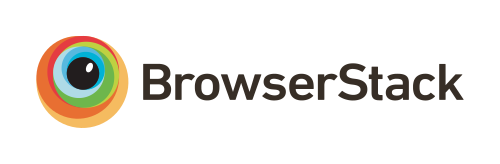

# Live2D Widget


## 特性 Feature

在网页中添加 Live2D 看板娘。兼容 PJAX，支持无刷新加载。  
Add Live2D widget to web page. Compatible with PJAX.

**警告：本项目使用了大量 ES6 语法，且依赖于 WebGL。不支持 IE 11 等老旧浏览器。**  
**WARNING: This project does not support legacy browsers such as IE 11.**

## 示例 Demo

在[米米的博客](https://zhangshuqiao.org)的左下角可查看效果。


这个仓库中也提供了两个 Demo，即

- [demo1.html](https://mi.js.org/live2d-widget/demo/demo1.html) ，展现基础效果
- [demo2.html](https://mi.js.org/live2d-widget/demo/demo2.html) ，仿 NPM 的登陆界面

## 依赖 Dependencies

本插件需要 Font Awesome 4.7.0 支持，请确保相关样式表已在页面中加载，例如在 `<head>` 中加入：  
Font Awesome 4.7.0 is required for this plugin. You can add this to `<head>`:
```xml
<link rel="stylesheet" href="https://cdn.jsdelivr.net/npm/font-awesome/css/font-awesome.min.css">
```
否则无法正常显示。（如果网页中已经加载了 Font Awesome，就不要重复加载了）

## 使用 Usage

将这一行代码加入 `<head>` 或 `<body>`，即可展现出效果：
```xml
<script src="https://cdn.jsdelivr.net/gh/stevenjoezhang/live2d-widget@latest/autoload.js"></script>
```
如果网站启用了 PJAX，由于看板娘不必每页刷新，因此要注意将相关脚本放到 PJAX 刷新区域之外。

换句话说，如果你是小白，或者只需要最基础的功能，就只用把这一行代码，连同前面加载 Font Awesome 的一行代码，一起放到 html 的 `<head>` 中即可。  
对于用各种模版引擎（例如 Nunjucks，Jinja 或者 PHP）生成的页面，也要自行修改，方法类似，只是可能略为麻烦。以 Hexo 为例，需要在主题相关的 ejs 或 njk 模版中正确配置路径，才可以加载。

**但是！我们强烈推荐自己进行配置，否则很多功能是不完整的，并且可能产生问题！**  
如果你有兴趣自己折腾的话，请看下面的详细说明。

### Using CDN

要自定义有关内容，可以把这个仓库 Fork 一份，然后进行修改。这时，使用方法对应地变为
```xml
<script src="https://cdn.jsdelivr.net/gh/username/live2d-widget@latest/autoload.js"></script>
```
将 `username` 替换为你的 GitHub 用户名即可。

### Self-host

你也可以直接把这些文件放到服务器上，而不是通过 CDN 加载。

- 如果你能够通过 `ssh` 访问你的主机，请把整个仓库克隆到服务器上。执行：
  ```bash
  cd /path/to/your/webroot
  # Clone this repository
  git clone https://github.com/stevenjoezhang/live2d-widget.git
  ```
- 如果你的主机无法用 `ssh` 连接（例如一般的虚拟主机），请选择 `Download ZIP`，然后通过 `ftp` 等方式上传到主机上，再解压到网站的目录下。
- 如果你是通过 Hexo 等工具部署的静态博客，请在本地开命令行进入博客目录，例如 `source` 下与 `_posts` 同级的目录，然后再执行前述的 `git clone` 命令。重新部署博客时，相关文件就会自动上传到对应的路径下。

这样，整个项目就可以通过你的服务器 IP 或者域名从公网访问了。不妨试试能否正常地通过浏览器打开 `autoload.js` 和 `live2d.min.js` 等文件，并确认这些文件的内容是正确的，没有出现乱码。  
一切正常的话，接下来修改一些配置就行了。（需要通过服务器上的文本编辑器修改；你也可以先在本地完成这一步骤，再上传到服务器上）  
修改 `autoload.js` 中的常量 `live2d_path` 为 `live2d-widget` 这一文件夹在公网上的路径。比如说，如果你能够通过
```
https://www.example.com/path/to/live2d-widget/live2d.min.js
```
访问到 `live2d.min.js`，那么就把 `live2d_path` 的值修改为
```
https://www.example.com/path/to/live2d-widget/
```
路径末尾的 `/` 一定要加上。具体可以参考 `autoload.js` 内的注释。  
完成后，在你要添加看板娘的界面加入
```xml
<script src="https://www.example.com/path/to/live2d-widget/autoload.js"></script>
```
就可以加载了。

## 目录结构 Files

- `waifu-tips.json` 中包含了触发条件（`selector`，选择器）和触发时显示的文字（`text`）；
- `waifu.css` 是看板娘的样式表。

源文件是对 Hexo 的 NexT 主题有效的，为了适用于你自己的网页，可能需要自行修改，或增加新内容。  
**警告：作者不对包括但不限于 `waifu-tips.json` 和 `waifu-tips.js` 文件中的内容负责，请自行确保它们是合适的。**

如果有任何疑问，欢迎提 Issue。如果有任何修改建议，欢迎提 Pull Request。

## 鸣谢 Credits

[](https://www.browserstack.com)

感谢 BrowserStack 容许我们在真实的浏览器中测试此项目。  
Thanks to BrowserStack for allowing us to test this project in real browsers.

代码自这篇博文魔改而来：  
https://www.fghrsh.net/post/123.html

点击看板娘的纸飞机按钮时，会出现一个彩蛋，这来自于 [WebsiteAsteroids](http://www.websiteasteroids.com)。

## 更多 More

更多内容可以参考：  
https://imjad.cn/archives/lab/add-dynamic-poster-girl-with-live2d-to-your-blog-02  
https://github.com/xiazeyu/live2d-widget.js  
https://github.com/summerscar/live2dDemo

还可以自行搭建后端 API，并增加模型（需要修改的内容比较多，此处不再赘述）：  
https://github.com/fghrsh/live2d_api  
https://github.com/xiazeyu/live2d-widget-models  
https://github.com/xiaoski/live2d_models_collection

除此之外，还有桌面版本：  
https://github.com/amorist/platelet  
https://github.com/akiroz/Live2D-Widget

## 许可证 License

Released under the GNU General Public License v3  
http://www.gnu.org/licenses/gpl-3.0.html

本仓库中涉及的所有 Live2D 模型、图片、动作数据等版权均属于其原作者，仅供研究学习，不得用于商业用途。

Live2D 官方网站：  
https://www.live2d.com/en/  
https://live2d.github.io

Live2D Cubism Core は Live2D Proprietary Software License で提供しています。  
https://www.live2d.com/eula/live2d-proprietary-software-license-agreement_en.html  
Live2D Cubism Components は Live2D Open Software License で提供しています。  
http://www.live2d.com/eula/live2d-open-software-license-agreement_en.html

> The terms and conditions do prohibit modification, but obfuscating in `live2d.min.js` would not be considered illegal modification.

https://community.live2d.com/discussion/140/webgl-developer-licence-and-javascript-question

## 更新 Update

2018年10月31日，由 fghrsh 提供的原 API 停用，请更新至新地址。参考文章：  
https://www.fghrsh.net/post/170.html

2020年1月1日起，本项目不再依赖于 jQuery。
