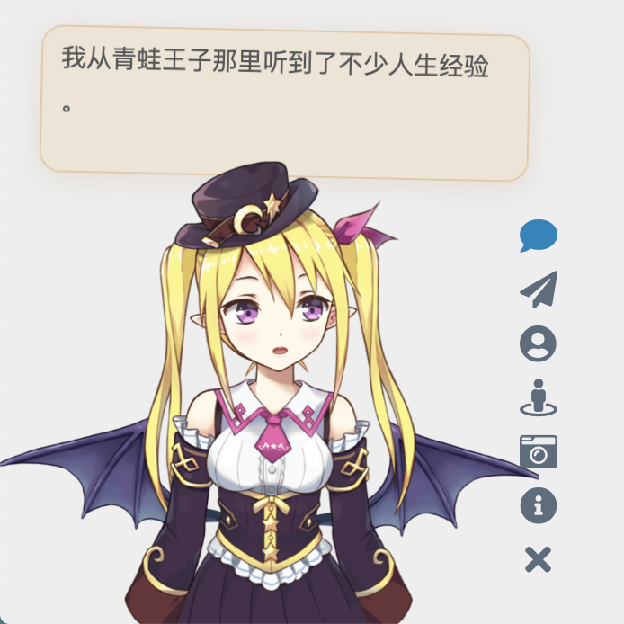
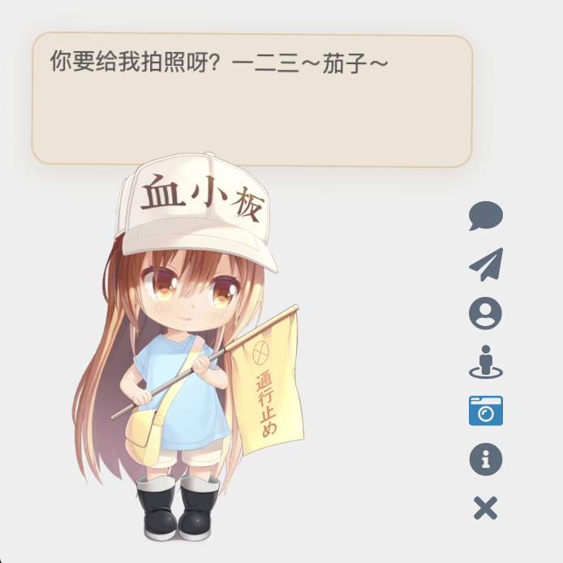

# Live2D Widget


[English](README.en.md)

## 特性

在网页中添加 Live2D 看板娘。兼容 PJAX，支持无刷新加载。



（注：以上人物模型仅供展示之用，本仓库并不包含任何模型。）

你也可以查看示例网页：

- 在 [米米的博客](https://zhangshuqiao.org) 的左下角可查看效果
- [demo/demo.html](https://live2d-widget.pages.dev/demo/demo)，展现基础功能
- [demo/login.html](https://live2d-widget.pages.dev/demo/login)，仿 NPM 的登陆界面

## 使用

如果你是小白，或者只需要最基础的功能，那么只用将这一行代码加入 html 页面的 `head` 或 `body` 中，即可加载看板娘：
```xml
<script src="https://fastly.jsdelivr.net/npm/live2d-widgets@0/autoload.js"></script>
```
添加代码的位置取决于你的网站的构建方式。例如，如果你使用的是 [Hexo](https://hexo.io)，那么需要在主题的模版文件中添加以上代码。对于用各种模版引擎生成的页面，修改方法类似。  
如果网站启用了 PJAX，由于看板娘不必每页刷新，需要注意将该脚本放到 PJAX 刷新区域之外。

**但是！我们强烈推荐自己进行配置，让看板娘更加适合你的网站！**  
如果你有兴趣自己折腾的话，请看下面的详细说明。

## 配置

你可以对照 `dist/autoload.js` 的源码查看可选的配置项目。`autoload.js` 会自动加载三个文件：`waifu.css`，`live2d.min.js` 和 `waifu-tips.js`。`waifu-tips.js` 会创建 `initWidget` 函数，这就是加载看板娘的主函数。`initWidget` 函数接收一个 Object 类型的参数，作为看板娘的配置。以下是配置选项：

| 选项 | 类型 | 默认值 | 说明 |
| - | - | - | - |
| `waifuPath` | `string` | `https://fastly.jsdelivr.net/npm/live2d-widgets@0/waifu-tips.json` | 看板娘资源路径，可自行修改 |
| `apiPath` | `string` | `https://live2d.fghrsh.net/api/` | API 路径，可选参数 |
| `cdnPath` | `string` | `https://fastly.jsdelivr.net/gh/fghrsh/live2d_api/` | CDN 路径，可选参数 |
| `tools` | `string[]` | 见 `autoload.js` | 加载的小工具按钮，可选参数 |

其中，`apiPath` 和 `cdnPath` 两个参数设置其中一项即可。`apiPath` 是后端 API 的 URL，可以自行搭建，并增加模型（需要修改的内容比较多，此处不再赘述），可以参考 [live2d_api](https://github.com/fghrsh/live2d_api)。而 `cdnPath` 则是通过 jsDelivr 这样的 CDN 服务加载资源，更加稳定。

## 自定义

如果以上「配置」部分提供的选项还不足以满足你的需求，那么你可以自己进行修改。本仓库的目录结构如下：

- `src/` 目录下包含了各个组件的代码，例如按钮和对话框等；
- `build/` 目录下包含了 TypeScript 构建后的文件；
- `dist/` 目录下包含了进一步打包后网页直接可用的文件，其中：
  - `autoload.js` 是用于自动加载其它资源，例如样式表等；
  - `waifu-tips.js` 是由 `build/waifu-tips.js` 自动打包生成的，不建议直接修改；
  - `waifu-tips.json` 中定义了触发条件（`selector`，CSS 选择器）和触发时显示的文字（`text`）；
  - `waifu.css` 是看板娘的样式表。

`waifu-tips.json` 中默认的 CSS 选择器规则是对 Hexo 的 [NexT 主题](http://github.com/next-theme/hexo-theme-next) 有效的，为了适用于你自己的网页，可能需要自行修改，或增加新内容。  
**警告：`waifu-tips.json` 中的内容可能不适合所有年龄段，或不宜在工作期间访问。在使用时，请自行确保它们是合适的。**

要在本地部署本项目的开发测试环境，你需要安装 Node.js 和 npm，然后执行以下命令：

```bash
git clone https://github.com/stevenjoezhang/live2d-widget.git
npm install
npm run build
```

如果有任何疑问，欢迎提 Issue。如果有任何修改建议，欢迎提 Pull Request。

## 部署

在本地完成了修改后，你可以将修改后的项目部署在服务器上，或者通过 CDN 加载，以便在网页中使用。

### 使用 CDN

要自定义有关内容，可以把这个仓库 Fork 一份，然后把修改后的内容通过 git push 到你的仓库中。这时，使用方法对应地变为
```xml
<script src="https://fastly.jsdelivr.net/gh/username/live2d-widget@latest/autoload.js"></script>
```
将此处的 `username` 替换为你的 GitHub 用户名。为了使 CDN 的内容正常刷新，需要创建新的 git tag 并推送至 GitHub 仓库中，否则此处的 `@latest` 仍然指向更新前的文件。此外 CDN 本身存在缓存，因此改动可能需要一定的时间生效。相关文档：
- [Git Basics - Tagging](https://git-scm.com/book/en/v2/Git-Basics-Tagging)
- [Managing releases in a repository](https://docs.github.com/en/repositories/releasing-projects-on-github/managing-releases-in-a-repository)

### Self-host

你也可以直接把这些文件放到服务器上，而不是通过 CDN 加载。

- 如果你能够通过 `ssh` 连接你的主机，请把 Fork 并修改后的代码仓库克隆到服务器上。
- 如果你的主机无法用 `ssh` 连接（例如一般的虚拟主机），请在本地修改好代码后，通过 `ftp` 等方式将文件上传到主机的网站的目录下。
- 如果你是通过 Hexo 等工具部署的静态博客，请把本项目的代码放在博客源文件目录下（例如 `source` 目录）。重新部署博客时，相关文件就会自动上传到对应的路径下。为了避免这些文件被 Hexo 插件错误地修改，可能需要设置 `skip_render`。

这样，整个项目就可以通过你的域名访问了。不妨试试能否正常地通过浏览器打开 `autoload.js` 和 `live2d.min.js` 等文件，并确认这些文件的内容是完整和正确的。  
一切正常的话，接下来修改 `autoload.js` 中的常量 `live2d_path` 为 `live2d-widget` 这一目录的 URL 即可。比如说，如果你能够通过
```
https://example.com/path/to/live2d-widget/live2d.min.js
```
访问到 `live2d.min.js`，那么就把 `live2d_path` 的值修改为
```
https://example.com/path/to/live2d-widget/
```
路径末尾的 `/` 一定要加上。  
完成后，在你要添加看板娘的界面加入
```xml
<script src="https://example.com/path/to/live2d-widget/autoload.js"></script>
```
就可以加载了。

## 鸣谢

<a href="https://www.browserstack.com/">
  <picture>
    <source media="(prefers-color-scheme: dark)" height="80" srcset="https://d98b8t1nnulk5.cloudfront.net/production/images/layout/logo-header.png?1469004780">
    <source media="(prefers-color-scheme: light)" height="80" srcset="https://live.browserstack.com/images/opensource/browserstack-logo.svg">
    
  </picture>
</a>

> 感谢 BrowserStack 容许我们在真实的浏览器中测试此项目。  
> Thanks to [BrowserStack](https://www.browserstack.com/) for providing the infrastructure that allows us to test in real browsers!

<a href="https://www.jsdelivr.com">
  <picture>
    <source media="(prefers-color-scheme: dark)" height="80" srcset="https://raw.githubusercontent.com/jsdelivr/jsdelivr-media/master/white/svg/jsdelivr-logo-horizontal.svg">
    <source media="(prefers-color-scheme: light)" height="80" srcset="https://raw.githubusercontent.com/jsdelivr/jsdelivr-media/master/default/svg/jsdelivr-logo-horizontal.svg">
    
  </picture>
</a>

> 感谢 jsDelivr 提供的 CDN 服务。  
> Thanks jsDelivr for providing public CDN service.

代码自这篇博文魔改而来：  
https://www.fghrsh.net/post/123.html

感谢 [一言](https://hitokoto.cn) 提供的语句接口。

点击看板娘的纸飞机按钮时，会出现一个彩蛋，这来自于 [WebsiteAsteroids](http://www.websiteasteroids.com)。

## 更多

更多内容可以参考：  
https://nocilol.me/archives/lab/add-dynamic-poster-girl-with-live2d-to-your-blog-02  
https://github.com/xiazeyu/live2d-widget.js  
https://github.com/summerscar/live2dDemo

关于后端 API 模型：  
https://github.com/xiazeyu/live2d-widget-models  
https://github.com/xiaoski/live2d_models_collection

除此之外，还有桌面版本：  
https://github.com/amorist/platelet  
https://github.com/akiroz/Live2D-Widget  
https://github.com/zenghongtu/PPet  
https://github.com/LikeNeko/L2dPetForMac

以及 Wallpaper Engine：  
https://github.com/guansss/nep-live2d

## 许可证

Released under the GNU General Public License v3  
http://www.gnu.org/licenses/gpl-3.0.html

本仓库并不包含任何模型，用作展示的所有 Live2D 模型、图片、动作数据等版权均属于其原作者，仅供研究学习，不得用于商业用途。

Live2D 官方网站：  
https://www.live2d.com/en/  
https://live2d.github.io

Live2D Cubism Core は Live2D Proprietary Software License で提供しています。  
https://www.live2d.com/eula/live2d-proprietary-software-license-agreement_en.html  
Live2D Cubism Components は Live2D Open Software License で提供しています。  
http://www.live2d.com/eula/live2d-open-software-license-agreement_en.html

> The terms and conditions do prohibit modification, but obfuscating in `live2d.min.js` would not be considered illegal modification.

https://community.live2d.com/discussion/140/webgl-developer-licence-and-javascript-question

## 更新日志

2018年10月31日，由 fghrsh 提供的原 API 停用，请更新至新地址。参考文章：  
https://www.fghrsh.net/post/170.html

2020年1月1日起，本项目不再依赖于 jQuery。

2022年11月1日起，本项目不再需要用户单独加载 Font Awesome。
